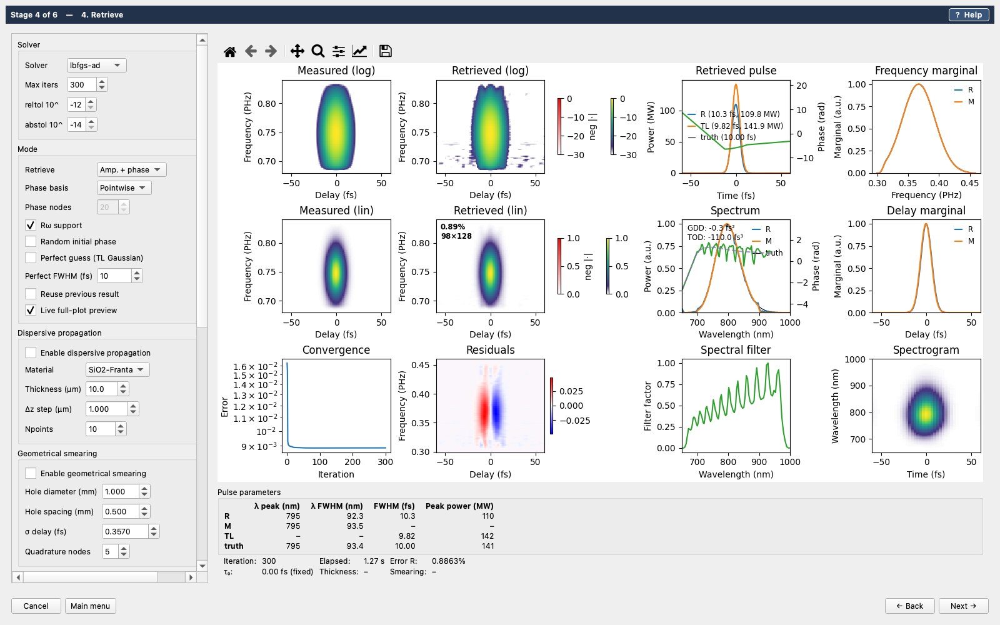
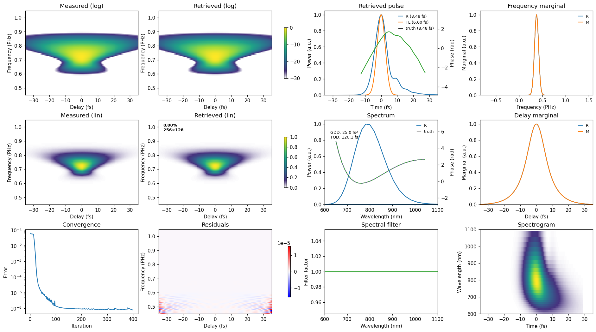

# croak

[](https://github.com/LupoLab/croak/actions/workflows/ci.yml)
[](https://codecov.io/gh/LupoLab/croak)
[](https://croak.readthedocs.io)
[](https://github.com/astral-sh/ruff)
[](https://github.com/microsoft/pyright)
[](https://pypi.org/project/croak/)
[](https://pypi.org/project/croak/)
[](LICENSE)
[](https://doi.org/10.5281/zenodo.22182305)

**Retrieval of ultrashort laser pulses from FROG traces — spectral amplitude
and phase.**

> **Just want the graphical FROG retrieval program?**
> See [Installing the GUI](docs/getting_started/gui.md) for install
> instructions that need no Python knowledge. (Standalone packaging is
> planned; for now the GUI installs with `uv` in a few commands.)

croak reconstructs the full complex electric field of an ultrashort pulse from
a delay-scanned nonlinear-process spectrum. It is a general retrieval package
for the PNPS (parameterised nonlinear process spectra) class of measurements,
currently focused on FROG: the SHG, SD and PG/transient-grating geometries,
ten solvers over a single physical forward model, and the workflow around them
— loading, cleaning, retrieval, post-processing, uncertainty, plotting and
saving. The library is headless (NumPy/SciPy/JAX); a PyQt6 GUI is optional.

What distinguishes it from a classic FROG code is the forward model. Standard
retrieval algorithms idealise the measurement: an infinitely thin,
non-dispersive nonlinear medium, an ideal beam geometry, and perfect signal
collection. Those idealisations fail for few-femtosecond pulses in the deep
ultraviolet, where a few micrometres of substrate stretch the pulse severalfold
during the measurement — a conventional retrieval then fits the trace to below
1% error while returning a pulse more than twice too long. croak instead
models the measurement physics directly:

- **dispersive propagation** of the input fields and the generated signal
  through the nonlinear medium;
- **geometric delay smearing** of the crossed-beam (BOXCARS) geometry, with a
  closed-form kernel set by the mask geometry, or fitted from the data;
- **the collection aperture**, as a coherent chromatic filter on the signal
  (the full focal model).

Because the whole model is a differentiable JAX program, gradients come from
automatic differentiation and retrieval is ordinary regularised least squares:
measured spectra, per-frequency response factors, and fitted physical
parameters (medium thickness, delay zero, smearing strength) enter by adding
them to the objective. Validated against first-principles 3D simulations of a
complete TG-FROG instrument, croak retrieves a ~1 fs, 260 nm pulse at every
substrate thickness from 1 to 40 µm, where the standard thin-medium model
returns 1.4–2.6 fs. The methods and the validation are described in the
companion paper (see [Citation](#citation)); every retrieval in that paper was
done with croak.



## Install

croak is [on PyPI](https://pypi.org/project/croak/) and needs **Python ≥ 3.14**.
The easiest route on every platform is [uv](https://docs.astral.sh/uv/), which
installs the right Python for you:

```bash
uv add croak                 # into a uv project
```

or into any environment of your own (`uv pip install croak`, or plain
`pip install croak`). For the GUI as a standalone command, no project needed:

```bash
uv tool install --python 3.14 "croak[gui]"
croak-gui
```

To work on croak itself — or to run the bundled examples, which ship with the
repository rather than the package — install from a clone:

```bash
git clone https://github.com/LupoLab/croak
cd croak
uv sync                  # create the environment and install croak
uv run python -c "import croak; print(croak.__version__)"
```

Then run anything inside that environment with `uv run`:

```bash
uv run python my_retrieval.py
uv run croak-gui
```

<details>
<summary><b>Platform notes</b> — read this if the install fails</summary>

The binary dependencies (`jax`, `nlopt`, `finufft`, `pyqt6`) do not publish
wheels for every platform. Where a wheel is missing, pip/uv falls back to
building from source, which needs CMake and a C++ toolchain.

| Platform | Status |
|---|---|
| **Linux x86_64** (glibc ≥ 2.34, i.e. Ubuntu 22.04+/RHEL 9+) | fully supported |
| **macOS, Apple Silicon**, macOS ≥ 14 | fully supported |
| **Windows x86_64** | fully supported |
| **macOS, Intel** | no `jaxlib` wheel exists — not supported |
| **Linux aarch64** | `nlopt` and `finufft` build from source |

**Linux also needs Qt's system libraries** for the GUI (neither uv nor pip
provides these):

```bash
sudo apt-get install -y libegl1 libgl1 libxkbcommon-x11-0 libdbus-1-3 \
  libxcb-icccm4 libxcb-image0 libxcb-keysyms1 libxcb-randr0 \
  libxcb-render-util0 libxcb-shape0 libxcb-xinerama0 libxcb-cursor0
```

**Python 3.14 is a hard floor**, not a preference — the source uses 3.14 syntax
and will not parse on 3.13. `uv python install 3.14` is the simplest fix.

**JAX installs CPU-only by default**, which is the right configuration for the
standard and extended models. For the full focal model, install
`jax[cuda12]` and use a GPU — see [Performance](#performance).

Prefer plain pip? `python3.14 -m venv .venv && . .venv/bin/activate && pip install -e .`

</details>

Optional extras: `croak[gui]` (the wizard), `croak[ridb]` (browse
refractiveindex.info materials — a few hundred MB downloaded on first use) and
`croak[evo]` (the cma-es global solver; pulls in `evosax` and its
`flax`/`optax` dependency tree). In a clone the same extras are
`uv sync --extra gui` etc.

## Quick start

```python
import numpy as np
import croak

# a time/frequency grid and a test pulse (2.5 fs Gaussian with some GDD)
g = croak.Grid(128, dt=0.3e-15)
ew = croak.gaussian_pulse(g, 2.5e-15, phases=[4e-30])   # phases = [GDD, TOD, ...]
delays = np.linspace(-18e-15, 18e-15, 87)

# synthesise a measured trace (here SHG-FROG)
trace = croak.maketrace(g.omega, delays, ew, "shg")

# retrieve — the same call for every algorithm ("warm-lbfgs" is the default)
res = croak.retrieve(trace, g.omega, delays, "shg", algorithm="warm-lbfgs")
print(res.error)            # final trace error R
field = res.field           # retrieved E(t)
spectrum = res.spectrum     # retrieved E(omega)
```

On measured data the workflow is the same shape, with cleaning in front:

```python
fd = croak.io.list_datasets("frog.h5")          # generic HDF5/NPZ dataset picker
lam = fd.load("wavelength") * croak.io.unit_to_si("nm")
delays = fd.load("delay") * croak.io.unit_to_si("fs")

td = croak.load_and_clean(fd.load("trace"), lam, delays, "shg",
                          lam_min=380e-9, lam_max=440e-9, input_unit="delay")

result = croak.retrieve_from_tracedata(td, algorithm="lbfgs", maxiters=200)
pr = croak.process_result(result, measured=td.trace)
croak.plot_retrieval(result, measured=td.trace).savefig("retrieval.png")
croak.save_result(result, "retrieval.h5", processed=pr)
```



## Solvers

Ten solvers spanning four algorithm families sit behind one `algorithm=`
argument over a single forward model, so changing solver changes nothing else.

| `algorithm` | Gradient | Use it for |
|---|---|---|
| `"warm-lbfgs"` | JAX autodiff | **the default** — `lbfgs-ad` started from COPRA's local sweep, much less sensitive to the initial guess |
| `"lbfgs-ad"` | JAX autodiff | the complete model: smearing, fitted thickness/τ₀, B-spline basis, penalties |
| `"copra"` | analytic adjoint | fast and robust from poor guesses (thin or dispersive medium) |
| `"lbfgs"` | analytic adjoint | phase-only, or custom regularisation, in pure NumPy |
| `"lm"` | JAX Jacobian | Levenberg–Marquardt polish to the lowest trace error |
| `"cma-es"` | none (global) | escaping a bad local minimum with no good guess |
| `"copra-jax"`, `"lbfgs-hand"`, `"lbfgs-optx"`, `"lm-optx"` | | on-device variants of the above |

For the core model — all three interactions, thin or dispersive medium — croak
also carries a hand-derived Wirtinger adjoint: exact closed-form gradients used
to verify the automatic differentiation (the two routes agree to ~1e-6 on every
supported combination). The AD route carries everything else, including the
physics the projection-based algorithms structurally cannot (the smearing
mixture and the collection model), so a new model feature needs no new
derivation.

## Performance

The forward model is JAX throughout, so the same code runs on CPU or GPU. The
standard and extended models retrieve in seconds on a laptop CPU. The full
focal model — the chromatic focal mixture with the modelled collection
aperture — is where the GPU matters: on an NVIDIA H200 it runs about **60× faster
than an Intel Xeon Gold 6240** (all cores) and **6.4× faster than an Apple M5
Max** with full threading, which is itself about 10× the Xeon.

## Scope

croak is built on the PNPS formalism: the same mathematics describes
frequency-resolved optical gating, time-domain ptychography, cross-correlation
FROG and dispersion scan, differing only in the signal operator. croak ships
the three FROG kernels today; the scan parameter is a delay throughout.
Because the interaction is the only geometry-specific ingredient, adding
another PNPS technique means supplying a `signal` method — automatic
differentiation covers the gradient. XFROG, TDP and d-scan are the natural
candidates; see [Interactions](docs/explanation/interactions.md).

The instrument-simulation side of the companion paper is
[ModelPNPS.jl](https://github.com/LupoLab/ModelPNPS.jl), a separate Julia
package that simulates PNPS measurements in three dimensions from the
underlying propagation physics. croak's validation datasets were produced
with it.

## GUI

A PyQt6 wizard (Load → Marginal check → Preprocess → Retrieve → Dispersion →
Uncertainty) drives the same library functions, with embedded plots, threaded
retrieval and a live preview:

```bash
uv run croak-gui          # or: uv run python -m croak.gui
```

Sessions save to TOML, and `croak replay` reruns one headlessly — or
`croak script` turns it into a standalone Python file you can edit. Importing
`croak` does **not** require Qt; only `croak.gui` does. See
[Installing the GUI](docs/getting_started/gui.md) and the
[GUI guide](docs/howto/gui.md).

## Examples

```bash
uv run python examples/example_retrieval.py              # shapes, geometries, noise, dispersion
uv run python examples/example_workflow.py               # load → retrieve → save
uv run python examples/example_paper_thickness.py        # the paper's 1 fs DUV trace, three models
uv run python examples/example_paper_rdw.py              # a simulated single-cycle RDW pulse
uv run python examples/example_geometric_smearing.py     # BOXCARS time smearing
uv run python examples/example_defringe.py               # interferometric fringe removal
uv run python examples/example_arpls_baseline.py         # + asymmetric baseline removal
uv run python examples/example_thickness_uncertainty.py  # fitted thickness & error bars
```

The first examples synthesise their own data. The two `example_paper_*`
scripts retrieve from reduced datasets of the companion paper's 3D instrument
simulations, shipped in [`examples/data/`](examples/data/README.md). The
examples and their data live in the repository, not in the PyPI package, so
run them from a clone.

## Documentation

Hosted at [croak.readthedocs.io](https://croak.readthedocs.io): tutorials, the
PNPS theory and the dispersive forward model, the solvers and gradient routes,
how-to guides, the validation results and the full API reference. The
[Features](docs/reference/features.md) page lists everything the package does.
To build locally:

```bash
uv sync --group docs
uv run sphinx-build -b html docs docs/_build/html
```

Start with **Getting started → Quickstart**, then the **Tutorials**.

## The name

croak stands for *Complete Retrieval by Optimisation and Adjoint Kernels*. It
was called `toad` (*Trace Optimisation through Automatic Differentiation*)
while it was an internal tool, and was renamed for release because that name
was already taken on PyPI — hence the unchanged amphibian on the icon. See
[the docs](docs/reference/naming.md).

## Citation

If you use croak in published work, please cite the companion paper:

> J. C. Travers and C. Brahms, *Extreme ultrashort pulse retrieval with
> differentiable physical forward models* (to be published).

(BibTeX and DOI will be added on publication.) The software itself is archived
on Zenodo — cite it via
[doi:10.5281/zenodo.22182305](https://doi.org/10.5281/zenodo.22182305) (all
versions) or see [CITATION.cff](CITATION.cff).

## Authors and licence

croak is developed by John Travers and Christian Brahms in the
[LUPO research group](https://lupo-lab.com) at Heriot-Watt University.
Released under the MIT licence — see [LICENSE](LICENSE).
